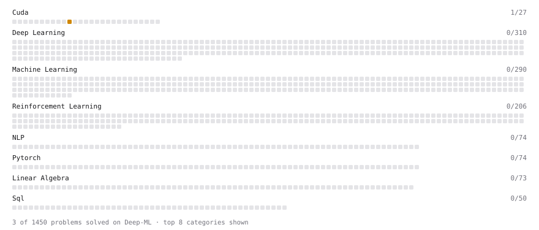

# Deep-ML

My machine learning practice from [Deep-ML](https://www.deep-ml.com). Every solution here was written by hand.

**17** solved · 10 problems · 0 labs · 7 math

[**Browse the interactive portfolio**](https://abs990.github.io/deep-ml/) to replay this filling in over time.

## Problems

| | Difficulty | Solved | |
| --- | --- | --- | --- |
| [Calculate Mean by Row or Column](https://www.deep-ml.com/problems/4) | easy | 2026-09-25 | [solution](problems/0004-calculate-mean-by-row-or-column) |
| [Derivative of a Polynomial](https://www.deep-ml.com/problems/116) | easy | 2026-09-25 | [solution](problems/0116-derivative-of-a-polynomial) |
| [Descriptive Statistics Calculator](https://www.deep-ml.com/problems/78) | easy | 2026-09-25 | [solution](problems/0078-descriptive-statistics-calculator) |
| [Empirical Probability Mass Function (PMF)](https://www.deep-ml.com/problems/184) | easy | 2026-09-25 | [solution](problems/0184-empirical-probability-mass-function-pmf) |
| [Expected Value and Variance of an n-Sided Die](https://www.deep-ml.com/problems/179) | easy | 2026-09-25 | [solution](problems/0179-expected-value-and-variance-of-an-n-sided-die) |
| [Gradient Direction and Magnitude](https://www.deep-ml.com/problems/308) | easy | 2026-09-25 | [solution](problems/0308-gradient-direction-and-magnitude) |
| [Linear Regression Using Gradient Descent](https://www.deep-ml.com/problems/15) | easy | 2026-09-25 | [solution](problems/0015-linear-regression-using-gradient-descent) |
| [Random Train/Validation/Test Split with Shuffling](https://www.deep-ml.com/problems/1058) | easy | 2026-09-25 | [solution](problems/1058-random-train-validation-test-split-with-shuffling) |
| [Dot Product](https://www.deep-ml.com/problems/1208) | medium | 2026-09-25 | [solution](problems/1208-dot-product) |
| [Quotient Rule for Derivatives](https://www.deep-ml.com/problems/312) | medium | 2026-09-25 | [solution](problems/0312-quotient-rule-for-derivatives) |

## Math

| | Difficulty | Solved | |
| --- | --- | --- | --- |
| [Derivatives and Gradients](https://www.deep-ml.com/math-problems/1) | easy | 2026-09-25 | [solution](math/0001-derivatives-and-gradients) |
| [Descriptive Statistics](https://www.deep-ml.com/math-problems/18) | easy | 2026-09-25 | [solution](math/0018-descriptive-statistics) |
| [Expectation and Variance Algebra](https://www.deep-ml.com/math-problems/33) | easy | 2026-09-25 | [solution](math/0033-expectation-and-variance-algebra) |
| [Gradient Descent Updates](https://www.deep-ml.com/math-problems/5) | easy | 2026-09-25 | [solution](math/0005-gradient-descent-updates) |
| [ML Workflow Basics](https://www.deep-ml.com/math-problems/30) | easy | 2026-09-25 | [solution](math/0030-ml-workflow-basics) |
| [Probability Fundamentals](https://www.deep-ml.com/math-problems/19) | easy | 2026-09-25 | [solution](math/0019-probability-fundamentals) |
| [Least Squares and the Normal Equations](https://www.deep-ml.com/math-problems/34) | medium | 2026-09-25 | [solution](math/0034-least-squares-and-the-normal-equations) |

---

_This file is regenerated by Deep-ML on every push._
